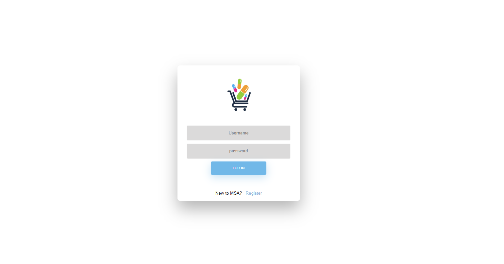
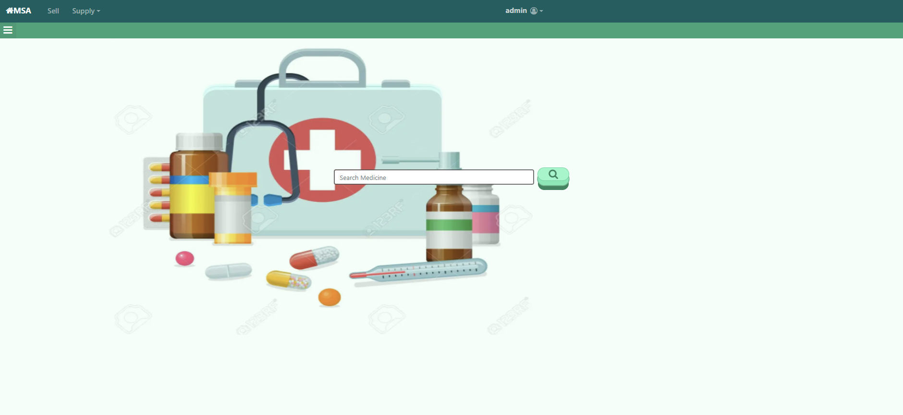
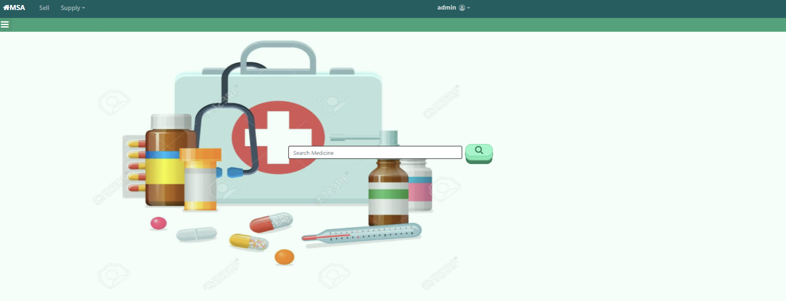
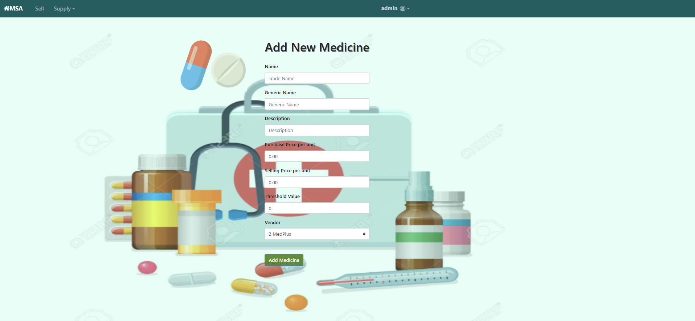
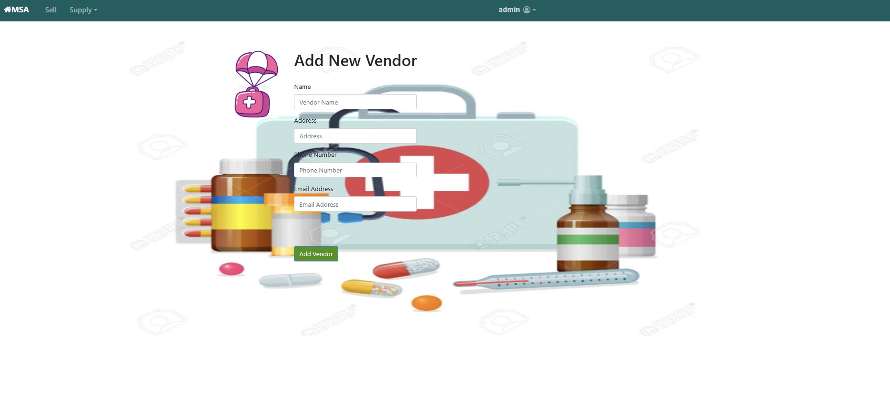
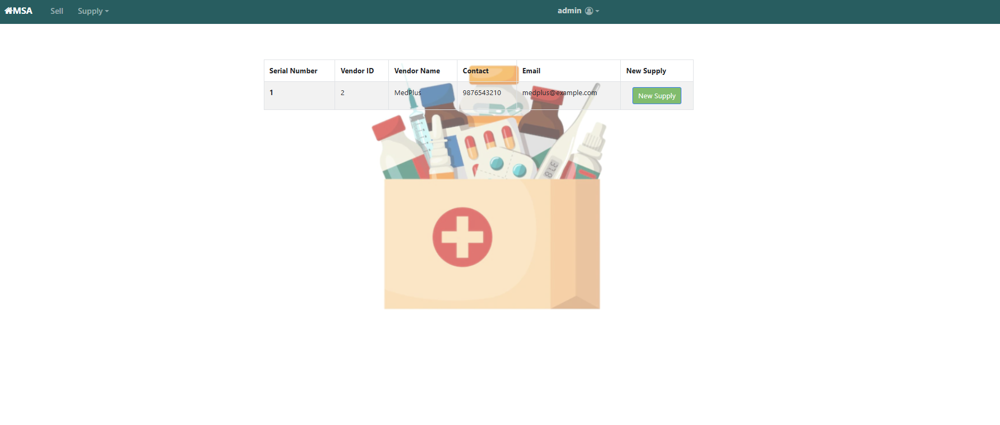
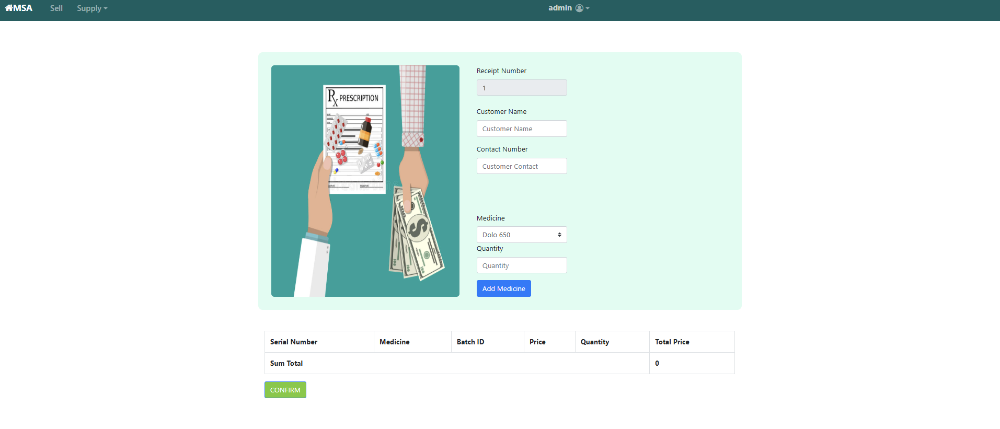

# 💊 Medical Shop Automation

A Django-based Medical Shop Automation System developed to streamline pharmacy operations by managing medicine inventory, customer records, and billing efficiently. The application provides an easy-to-use interface for pharmacy staff and helps reduce manual work through automation.

---

## 📌 Project Overview

Medical Shop Automation is a web-based application built using Django. It enables pharmacy administrators to manage medicines, customers, billing, and inventory through a centralized system. The project focuses on improving accuracy, reducing paperwork, and making day-to-day pharmacy operations more efficient.

---

## ✨ Features

- 🔐 Secure User Login
- 💊 Medicine Inventory Management
- 👥 Customer Management
- 🧾 Billing and Invoice Generation
- 📦 Stock Management
- 🔍 Search Medicines
- 📊 Simple Admin Dashboard

---

## 🛠️ Tech Stack

- Python
- Django
- HTML
- CSS
- Bootstrap
- SQLite

---

## 📁 Project Structure

```
Medical-Shop-Automation
│
├── msa/
│   ├── manage.py
│   ├── msa/
│   └── shop/
│
├── README.md
├── requirements.txt
├── runtime.txt
└── Procfile
```

---

## 🚀 Installation

```bash
git clone https://github.com/Arundhathi2425/Medical-Shop-Automation.git

cd Medical-Shop-Automation

pip install -r requirements.txt

cd msa

python manage.py migrate

python manage.py runserver
```

---

---

## 🔮 Future Enhancements

- Barcode Scanner Integration
- Online Payment Support
- Sales Analytics Dashboard
- Email Notifications
- Multi-user Authentication

---

## 👩‍💻 Author

**Arundhathi**


## 📷 Screenshots

### Login Page


### Dashboard


### Medicine Search


### Add New Medicine


### Add New Vendor


### New Supply


### Medicine List


### Sell Medicine


